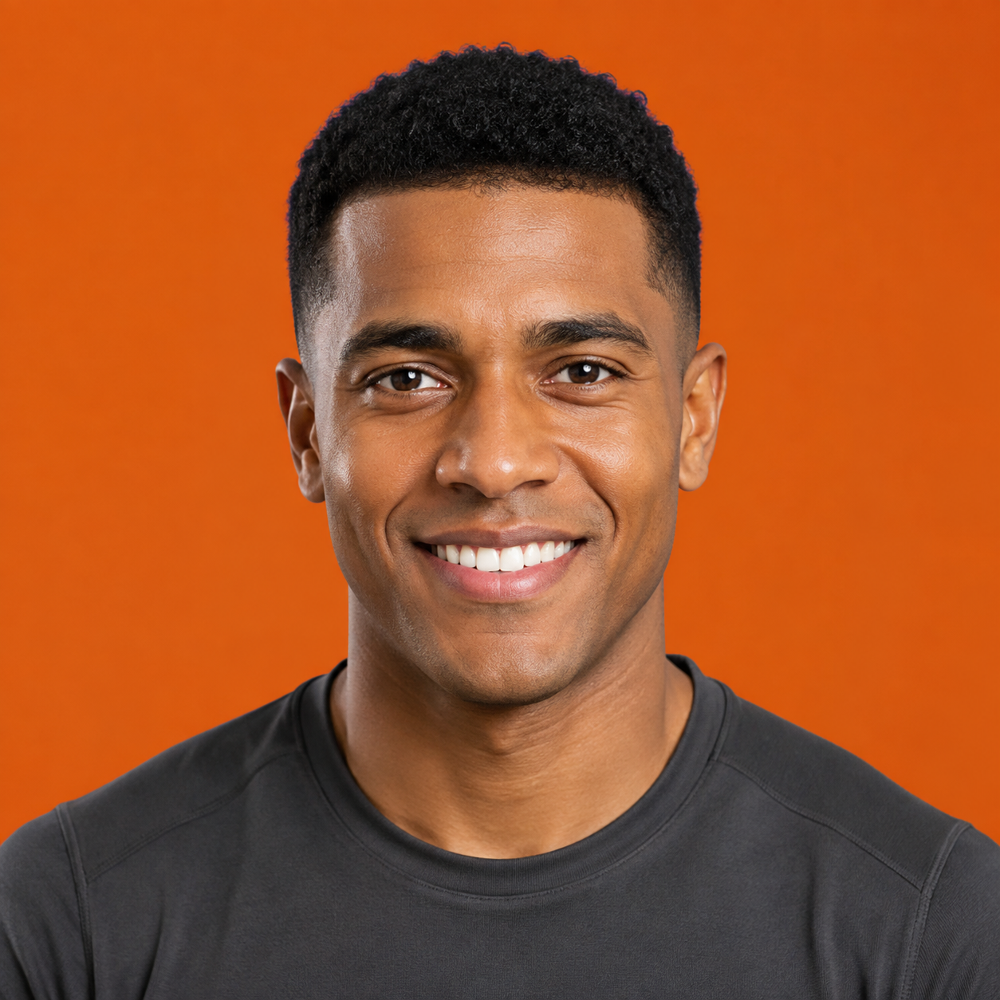
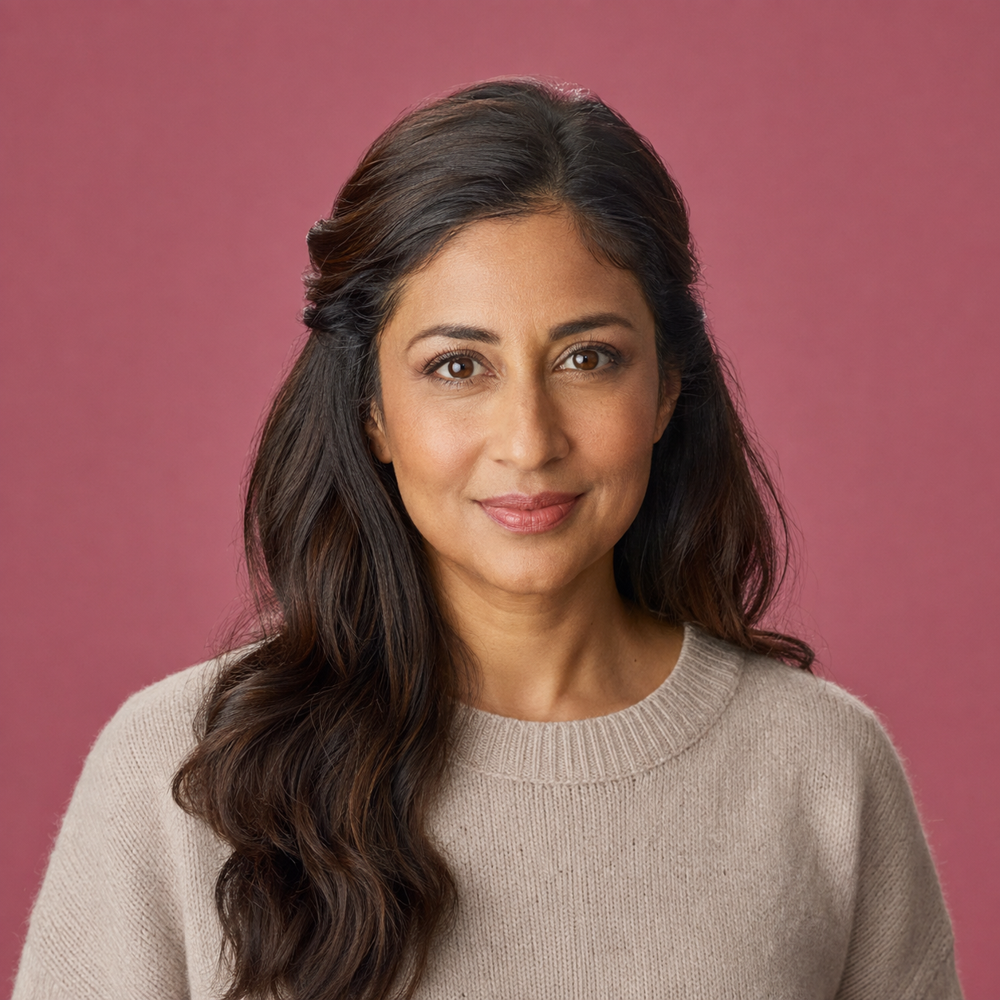
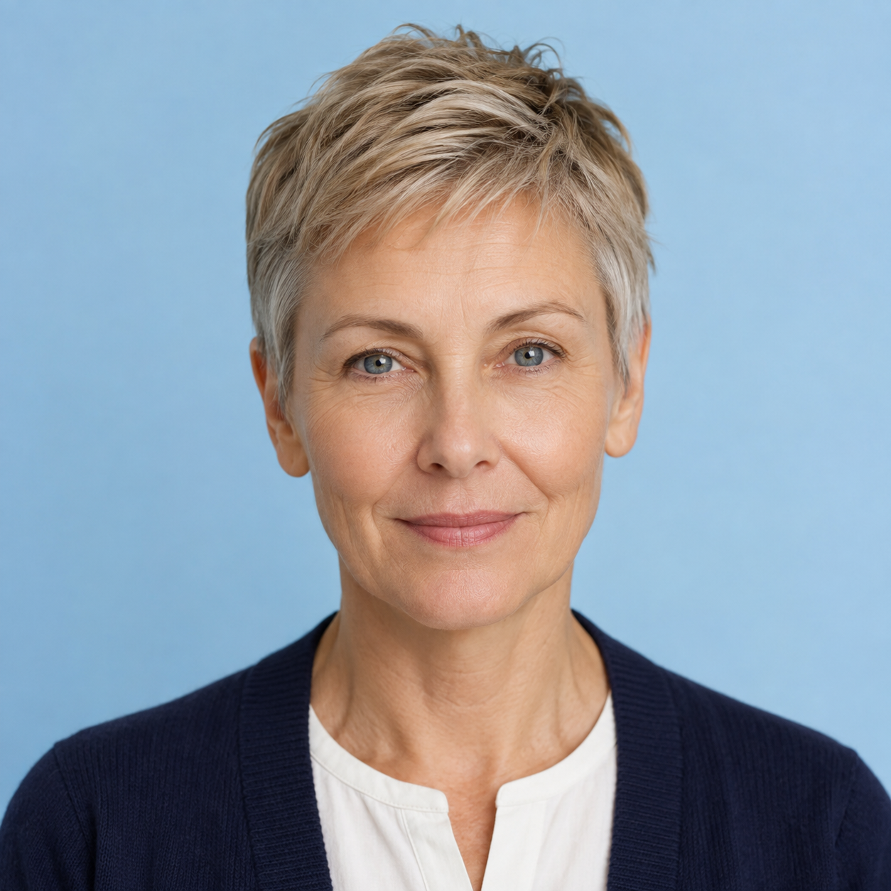
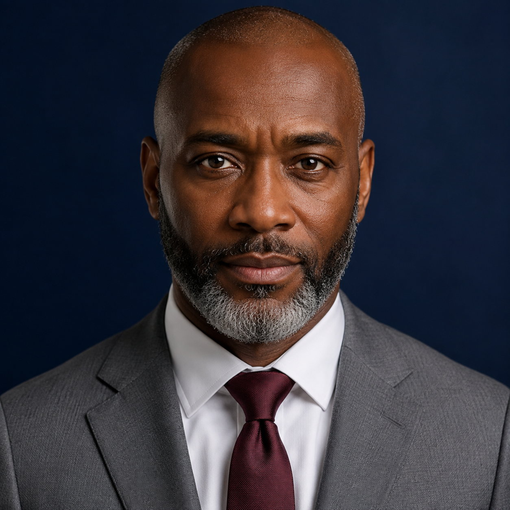
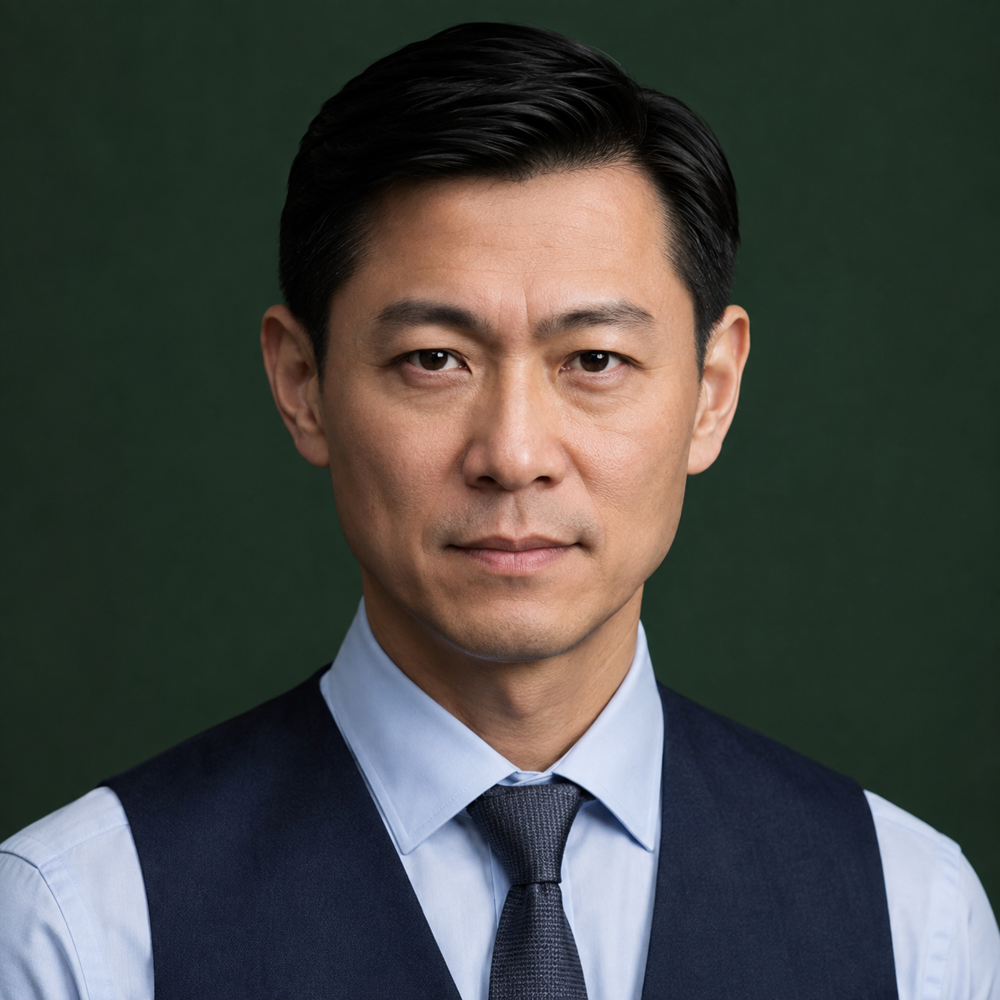
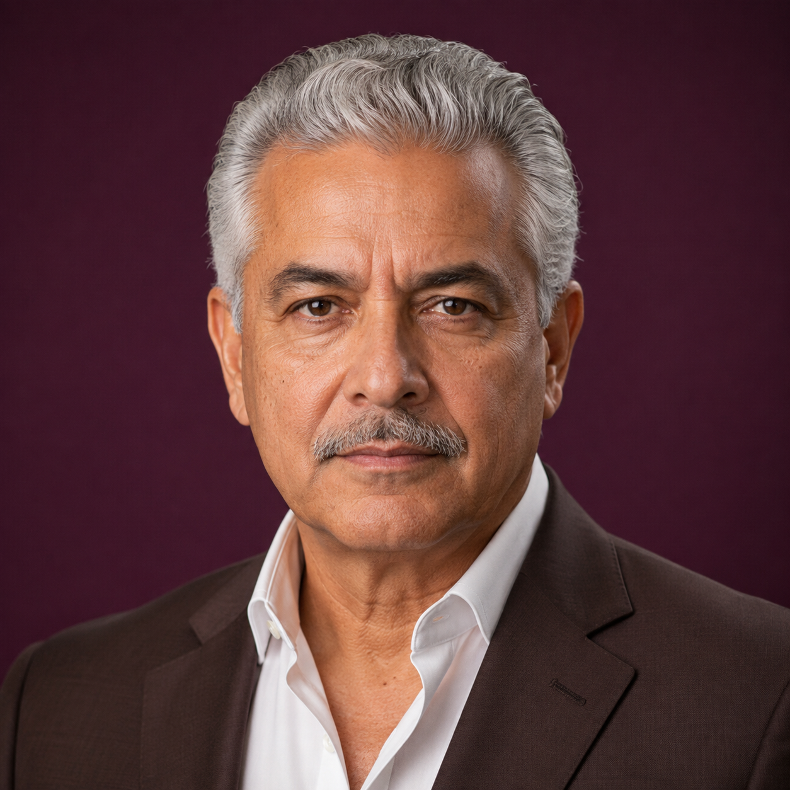
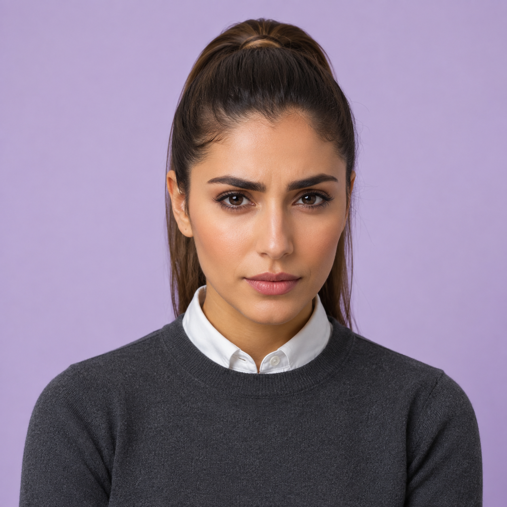
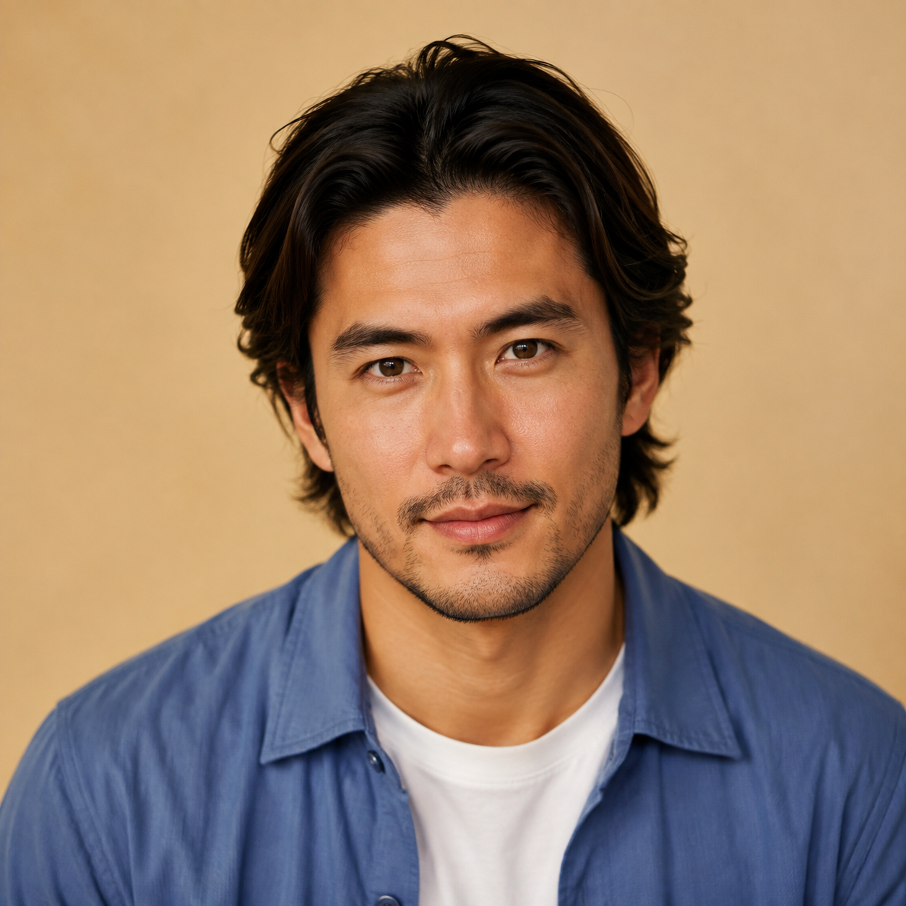
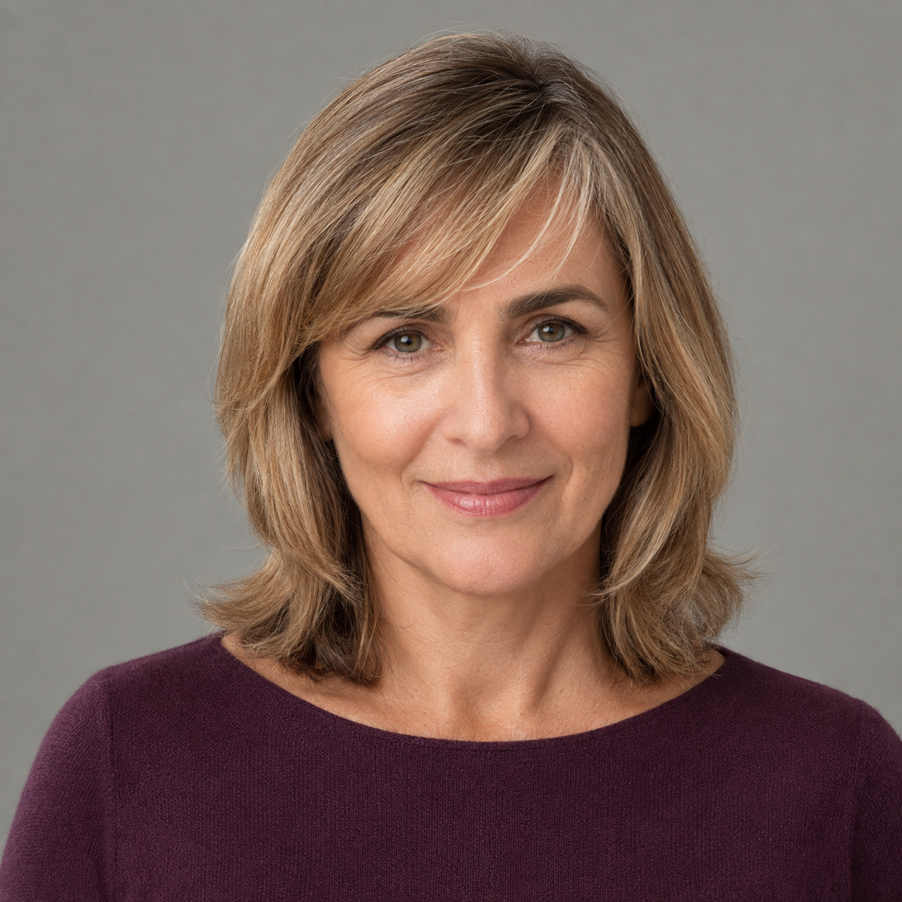

# Selected portrait collection

Generated with the built-in image-generation tool using the agreed fictional portrait designs. The collection contains 12 specialists and three selected system agents, all integrated into local app source. This is not a deployment claim. Elena is the approved auburn-haired portrait. Only selected portraits are included in the collection ZIP.

See [Ada, Theo and Heimdall](SYSTEM_AGENTS.md) for their selected portraits and prompts. Li is excluded.

## Sofia — Health & Medical Adviser

Use case: photorealistic-natural. Asset: individual square specialist thumbnail portrait preview for fictional AI character Sofia. Professional photorealistic headshot portrait, Greek woman in her early 40s with dark-brown hair neatly secured in a low chignon, wearing a clean white clinical coat over a pale-blue scrubs top, looking directly at camera with a calm and reassuring expression, soft natural studio lighting, shallow depth of field, shoulders-up crop, plain solid muted teal (#257D82) background, high resolution, shot on 85mm lens, realistic skin texture, no text, no logo, not a real identifiable person. Single person only, centred frontal composition, entire hairstyle within frame with modest headroom, polished conventional professional styling. No name label, no collage, no jewellery or tattoos as focal points.

## Marco — Fitness & Performance Coach

Use case: photorealistic-natural. Asset: individual square specialist thumbnail portrait preview for fictional AI character Marco. Professional photorealistic headshot portrait, Afro-Brazilian man in his early 30s with short tightly curled black hair in a neatly tapered cut and a clean-shaven face, wearing a fitted charcoal technical training shirt with a simple crew neck, looking directly at camera with a energetic and encouraging expression, soft natural studio lighting, shallow depth of field, shoulders-up crop, plain solid burnt orange (#D96A24) background, high resolution, shot on 85mm lens, realistic skin texture, no text, no logo, not a real identifiable person. Single person only, centred frontal composition, entire hairstyle within frame with modest headroom, polished conventional professional styling. No name label, no collage, no jewellery or tattoos as focal points.

## Elena — Nutrition, Cooking, Food & Drink Expert

Professional photorealistic headshot portrait, Portuguese woman in her mid-30s with auburn hair neatly swept into a compact bun, a few soft natural freckles and distinct hazel eyes, wearing a crisp ivory double-breasted chef's jacket with a traditional stand collar, looking directly at camera with a warm, confident, welcoming smile, soft natural studio lighting, shallow depth of field, centred shoulders-up crop with whole hairstyle visible, plain solid butter yellow (#F2D76B) background, high resolution, shot on 85mm lens, realistic skin texture, no text, no logo, not a real identifiable person.

## Amelia — Relationships, Dating & Social Adviser

Use case: photorealistic-natural. Asset: individual square specialist thumbnail portrait preview for fictional AI character Amelia. Professional photorealistic headshot portrait, British Indian woman in her early 40s with long espresso-brown hair arranged in smooth loose waves and neatly pinned back on one side, wearing a soft oatmeal cashmere sweater with a modest rounded neckline, looking directly at camera with a warm, empathetic and attentive expression, soft natural studio lighting, shallow depth of field, shoulders-up crop, plain solid dusty rose (#BE7188) background, high resolution, shot on 85mm lens, realistic skin texture, no text, no logo, not a real identifiable person. Single person only, centred frontal composition, entire hairstyle within frame with modest headroom, polished conventional professional styling. No name label, no collage, no jewellery or tattoos as focal points.

## Freja — Parenting & Family Adviser

Use case: photorealistic-natural. Asset: individual square specialist thumbnail portrait preview for fictional AI character Freja. Professional photorealistic headshot portrait, Danish woman in her early 50s with a tidy ash-blonde pixie cut and natural silver strands at the temples, wearing a fine-gauge navy cardigan over a simple cream cotton blouse, looking directly at camera with a patient, approachable and gently reassuring expression, soft natural studio lighting, shallow depth of field, shoulders-up crop, plain solid powder blue (#B7D6F2) background, high resolution, shot on 85mm lens, realistic skin texture, no text, no logo, not a real identifiable person. Single person only, centred frontal composition, entire hairstyle within frame with modest headroom, polished conventional professional styling. No name label, no collage, no jewellery or tattoos as focal points.

## Oliver — Legal & Regulatory Adviser

Use case: photorealistic-natural. Asset: individual square specialist thumbnail portrait preview for fictional AI character Oliver. Professional photorealistic headshot portrait, Black British man of Ghanaian heritage in his early 50s with a closely shaved head and a precisely trimmed salt-and-pepper beard, wearing a tailored medium-grey wool suit with a crisp white shirt and a restrained burgundy silk tie, looking directly at camera with a sharp, composed and attentive expression, soft natural studio lighting, shallow depth of field, shoulders-up crop, plain solid midnight navy (#172C50) background, high resolution, shot on 85mm lens, realistic skin texture, no text, no logo, not a real identifiable person. Single person only, centred frontal composition, entire hairstyle within frame with modest headroom, polished conventional professional styling. No name label, no collage, no jewellery or tattoos as focal points.

## James — Finance & Wealth Adviser

Use case: photorealistic-natural. Asset: individual square specialist thumbnail portrait preview for fictional AI character James. Professional photorealistic headshot portrait, British Chinese man in his mid-40s with straight black hair in a precise side-parted cut and a clean-shaven face, wearing a tailored navy waistcoat over a pale-blue business shirt with a subtle dark-grey tie, looking directly at camera with a steady, thoughtful and trustworthy expression, soft natural studio lighting, shallow depth of field, shoulders-up crop, plain solid deep forest green (#244E39) background, high resolution, shot on 85mm lens, realistic skin texture, no text, no logo, not a real identifiable person. Single person only, centred frontal composition, entire hairstyle within frame with modest headroom, polished conventional professional styling. No name label, no collage, no jewellery or tattoos as focal points.

## Victor — Business, Commercial & CCO Adviser

Use case: photorealistic-natural. Asset: individual square specialist thumbnail portrait preview for fictional AI character Victor. Professional photorealistic headshot portrait, Colombian Latino man in his late 50s with thick silver hair neatly swept back and a carefully trimmed silver moustache, wearing a tailored dark-brown executive suit over an open-collar white poplin shirt, looking directly at camera with a assured, perceptive and decisive expression, soft natural studio lighting, shallow depth of field, shoulders-up crop, plain solid dark aubergine (#512944) background, high resolution, shot on 85mm lens, realistic skin texture, no text, no logo, not a real identifiable person. Single person only, centred frontal composition, entire hairstyle within frame with modest headroom, polished conventional professional styling. No name label, no collage, no jewellery or tattoos as focal points.

## Nora — Research, Intelligence & Decision Adviser

Use case: photorealistic-natural. Asset: individual square specialist thumbnail portrait preview for fictional AI character Nora. Professional photorealistic headshot portrait, Lebanese woman in her late 20s with straight chestnut hair secured in a polished high ponytail, wearing a charcoal fine-knit crew-neck sweater over a neatly buttoned white Oxford shirt, looking directly at camera with a inquisitive, focused and thoughtfully sceptical expression, soft natural studio lighting, shallow depth of field, shoulders-up crop, plain solid pale lavender (#D1C2EC) background, high resolution, shot on 85mm lens, realistic skin texture, no text, no logo, not a real identifiable person. Single person only, centred frontal composition, entire hairstyle within frame with modest headroom, polished conventional professional styling. No name label, no collage, no jewellery or tattoos as focal points.

## Milo — Travel, Leisure & Experiences Adviser

Use case: photorealistic-natural. Asset: individual square specialist thumbnail portrait preview for fictional AI character Milo. Professional photorealistic headshot portrait, mixed Japanese and Italian man in his late 20s with medium-length dark-brown hair in a neatly brushed-back layered cut and light well-maintained stubble, wearing a clean slate-blue lightweight travel overshirt over a plain white cotton T-shirt, looking directly at camera with a friendly, curious and adventurous expression, soft natural studio lighting, shallow depth of field, shoulders-up crop, plain solid warm sand (#D9BD94) background, high resolution, shot on 85mm lens, realistic skin texture, no text, no logo, not a real identifiable person. Single person only, centred frontal composition, entire hairstyle within frame with modest headroom, polished conventional professional styling. No name label, no collage, no jewellery or tattoos as focal points.

## Iris — Home, Interior Design, Plants & Gardening Adviser

Use case: photorealistic-natural. Asset: individual square specialist thumbnail portrait preview for fictional AI character Iris. Professional photorealistic headshot portrait, mixed Dutch and Surinamese woman in her mid-30s with short copper-brown natural curls shaped into a neat rounded crop, wearing an olive cotton studio apron over a crisp cream work shirt with a structured collar, looking directly at camera with a observant, creative and warmly practical expression, soft natural studio lighting, shallow depth of field, shoulders-up crop, plain solid brick red (#A73D35) background, high resolution, shot on 85mm lens, realistic skin texture, no text, no logo, not a real identifiable person. Single person only, centred frontal composition, entire hairstyle within frame with modest headroom, polished conventional professional styling. No name label, no collage, no jewellery or tattoos as focal points.

## Clara — Wellbeing, Habits & Mental Performance Adviser

Use case: photorealistic-natural. Asset: individual square specialist thumbnail portrait preview for fictional AI character Clara. Professional photorealistic headshot portrait, Argentine woman of European heritage in her late 40s with a polished honey-blonde shoulder-length cut and a soft side fringe, wearing a muted plum merino-knit top with a modest boat neckline, looking directly at camera with a grounded, encouraging and gently optimistic expression, soft natural studio lighting, shallow depth of field, shoulders-up crop, plain solid neutral stone grey (#A6AAA5) background, high resolution, shot on 85mm lens, realistic skin texture, no text, no logo, not a real identifiable person. Single person only, centred frontal composition, entire hairstyle within frame with modest headroom, polished conventional professional styling. No name label, no collage, no jewellery or tattoos as focal points.
